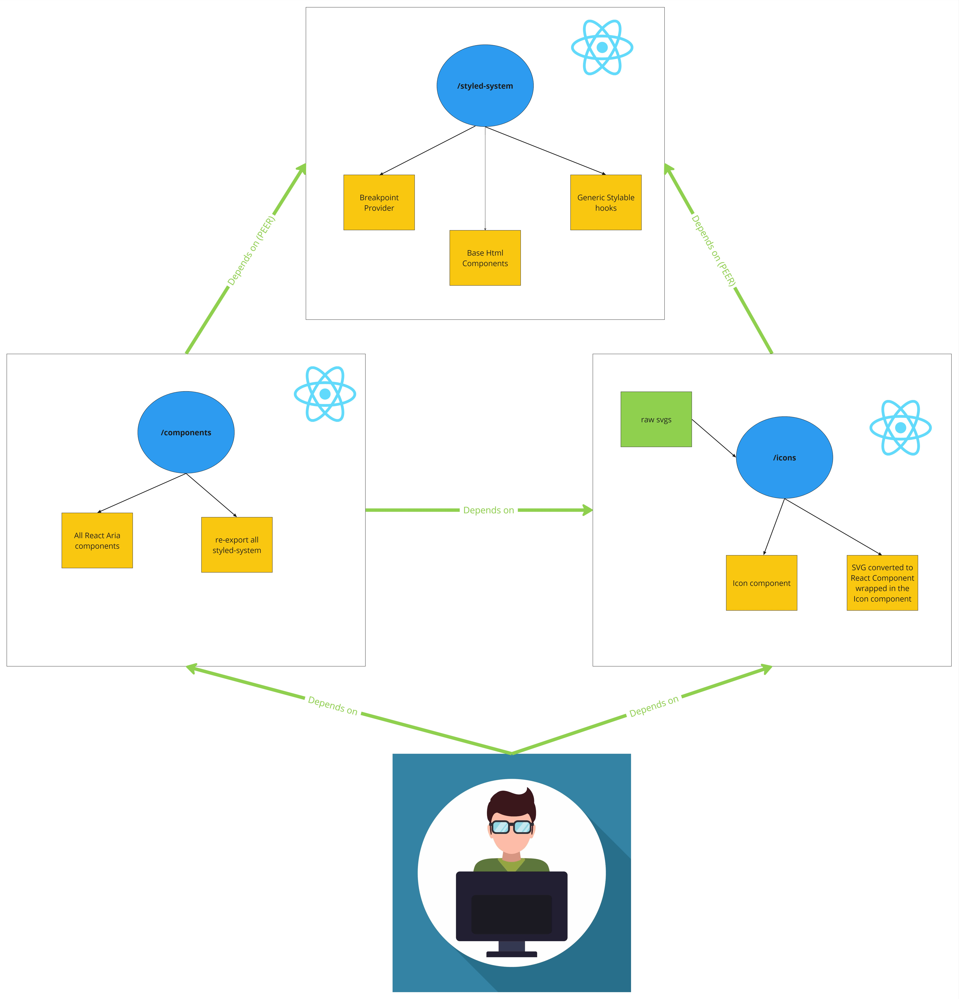

# hopper-tree-shaking-stats
Gather stats about the size of our packages

to test the gzip size, i've compressed the dist folder into a .tar , then compressed the .tar file into a .gz using 7zip for both

## Summary

| App  | Size  | GZippedSize  | Diff  |
|---|---|---|---|
| React Only  | 138KB  |  43.5KB | -  |
| with Styled System  |  269KB  | 63.4KB  | +131KB / 19.9KB  |
| with 1 icon (and SS)  | 316KB  | 78KB  | +178KB / 34.5KB |
| with only Orbiter  | 2.5MB  |  1.3MB | +2.062MB / 1.2565MB |
| react-aria-components-button  | 200KB  | 61.4KB | + 62KB / 16.1KB|
| react-aria-components-button with 1 icon (and SS) | 363KB  | 90.7KB | +225KB / 47.2KB |

## Package dependencies

## Details

1-react-only
dist folder size: 138 KB (141,969 bytes)
dist folder size on disk: 140 KB (143,360 bytes)

gzipped size: 43.5 KB (44,640 bytes)
gzipped size on disk: 44.0 KB (45,056 bytes)

2-styled-system

dist folder size: 269 KB (276,229 bytes)
dist folder size on disk: 276 KB (282,624 bytes)

gzipped size: 63.4 KB (64,960 bytes)
gzipped size on disk: 64.0 KB (65,536 bytes)

3-styled-system with 1 icon

dist folder size: 316 KB (324,022 bytes)
dist folder size on disk: 320 KB (327,680 bytes)

gzipped size: 78.0 KB (79,914 bytes)
gzipped size on disk: 80.0 KB (81,920 bytes)

4-orbiter

dist folder size: 2.50 MB (2,623,223 bytes)
dist folder size on disk: 2.54 MB (2,666,496 bytes)

gzipped size: 1.30 MB (1,373,747 bytes)
gzipped size on disk: 1.31 MB (1,376,256 bytes)

5- react-aria-components-button

dist folder size: 200 KB (205,012 bytes)
dist folder size on disk: 200 KB (204,800 bytes)

gzipped size:  61.4 KB (62,946 bytes)
gzipped size on disk: 64.0 KB (65,536 bytes)

6-react-aria-components-button with 1 icon

dist folder size: 363 KB (371,829 bytes)
dist folder size on disk: 368 KB (376,832 bytes)

gzipped size:  90.7 KB (92,962 bytes)
gzipped size on disk: 92.0 KB (94,208 bytes)
